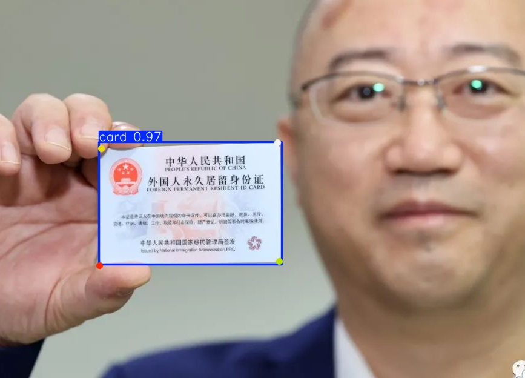
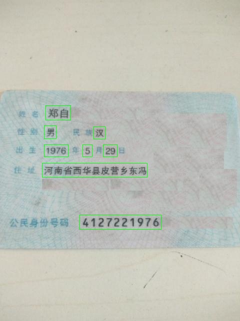
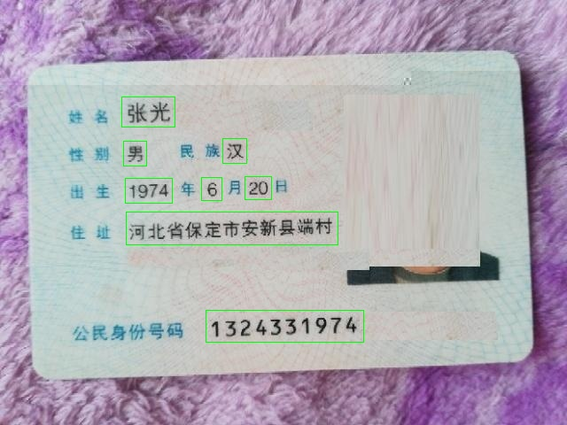

### 项目介绍
```
本项目中主要包含三个模型
１．models/det/cardpose.pt:基于卡证的最小外包框和四个角点的检测模型,数据集来源于SyntheticCards，模型是yolo
2. models/det/det2.pt: 身份证关键信息检测模型, yolo
3. models/rec/rec.onnx: 身份证文字识别模型
```

### 本项目测试依赖包
```
onnxruntime-gpu 1.16.3
ultralytics 8.3.31
```

### 识别思路
```
1.校正身份证的方向;
2.检测身份证的关键信息位置并切出小图片;
3.识别切出小图片中的文字;
```

### 免责声明
```
1.本项目仅供学习交流使用，请勿用于商业用途;
2.本项目只使用了200张身份证图片训练，识别准确率可能不高，如果发现错误不要惊奇;
```
### 运行方式
```
python infer.py
```

```
python idcardrec.py --image_dir=imgs/rec
```

```
{'姓名': '郑自', '性别': '男', '民族': '汉', '出生': '1976-5-29', '身份证号': '4127221976', '住址': '河南省西华县皮营乡东冯'}
```

```
{'姓名': '张光', '性别': '男', '民族': '汉', '出生': '1974-6-20', '身份证号': '1324331974', '住址': '河北省保定市安新县端村'}
```


